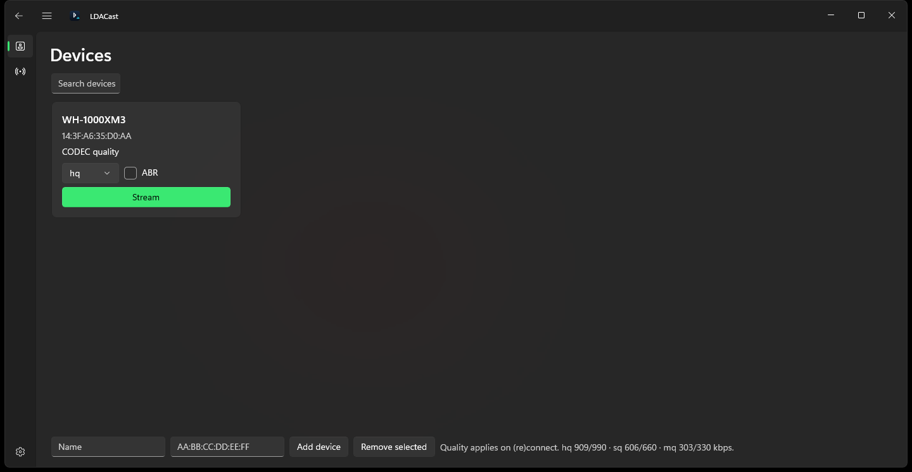

# LDACast

A user-mode LDAC A2DP source for Windows 10/11: stream system audio to Sony
(and other LDAC-capable) Bluetooth headphones in LDAC quality, with a Fluent
desktop app in the style of DLSS Swapper.

Windows ships no LDAC codec for A2DP and does not expose L2CAP to user mode,
so this program takes a generic CSR8510-class USB Bluetooth dongle for itself
(via WinUSB) and runs the whole HCI/L2CAP/AVDTP/A2DP path with BTstack,
encoding the WASAPI loopback mix with Sony's libldac.



## Features

- **LDAC on Windows**: HQ (909/990 kbps), SQ (606/660), MQ (303/330), plus
  experimental ABR that steers quality from buffer depth.
- **DLSS Swapper-style app** (`ui/LDACast`, C# / WinUI 3): device cards with
  per-device quality + ABR, one-click radio switch, capture-source dropdown
  (default device or virtual cable), live stream health
  (realtime ratio, wire rate, buffer, over/underruns, sink caps, negotiated
  config) with an automatic drop-a-rung hint, safe-parameters button,
  and a stability guide page.
- **One-command radio switch** (`tools/ldacmode.ps1 status|bt|ldac`):
  hand the dongle between Windows and LDACast in seconds, no replug.
- **Dedicated capture source** (`--capture NAME`, `--list-capture`): capture
  a virtual cable (e.g. VB-CABLE) instead of the default device, so music
  routes silently to the headphones instead of blaring from the speakers.
  `--check-capture` reports a device's mix format and exits without touching
  the radio, and `--help` lists every flag.
- **Automatic pairing**: first connect bonds over SSP Just Works; link keys
  persist per radio, reconnects are silent after that.
- **Measured, not assumed**: the design decisions were checked against packet
  traces from this radio — see [ARCHITECTURE.md](ARCHITECTURE.md). What has
  _not_ been verified is listed in [LIMITATIONS.md](LIMITATIONS.md).

## Quick start

Prerequisites: Rust (1.98+, `x86_64-pc-windows-msvc`), Visual Studio 2022
with the C++ workload, LLVM, .NET 8 SDK (for the app),
[Zadig](https://zadig.akeo.ie) (once, to bind the dongle to WinUSB), and a
CSR8510-class Bluetooth dongle (e.g. TP-Link UB400).

`crates/ldac-sys` and `crates/btstack-sys` run bindgen, which needs libclang.
It is normally picked up from `PATH`; only if the build cannot find it, set
`$env:LIBCLANG_PATH = 'C:\Program Files\LLVM\bin'` first.

```powershell
git clone --recursive https://github.com/YoshKoz/LDACast.git
cd LDACast
cargo build --release
cargo test --workspace
```

Give the dongle to the app (one-time Zadig step
[below](#give-the-dongle-to-this-program)), then either click **Stream** in the
desktop app or run:

```powershell
.\target\release\ldacsrc.exe --addr 14:3F:A6:35:D0:AA --quality sq
```

The sink must be in pairing mode the first time; link keys are stored next
to the working directory. Every HCI packet goes to `ldacsrc.pklg` (readable
with `python third_party\btstack\tool\dump_pklg.py`); the program's own log
lines go to stdout. A status line every 5 seconds reports buffer depth,
packet/frame counts, measured wire rate, encoder bitrate/EQMID, ring
over/underruns and errors.

## Switching the radio between Windows and LDACast

Once WinUSB has been installed once (below), ownership is a single command
and needs no Zadig and no replug:

```powershell
.\tools\ldacmode.ps1 status   # who owns the radio right now
.\tools\ldacmode.ps1 bt       # give it back to Windows
.\tools\ldacmode.ps1 ldac     # hand it to this program
.\tools\ldacmode.ps1 ldac -Run   # ...and start streaming
```

It refuses to switch while `ldacsrc` is running, elevates itself, and reports
the driver and child nodes it ended up with rather than assuming the switch
worked. Measured 3-11 seconds per switch.

## Give the dongle to this program

1. Start Zadig **as administrator**
2. Options -> List All Devices
3. Pick the device whose USB ID is your Bluetooth radio (here: `0A12 0001`)
4. Choose **WinUSB** as the target driver, then Replace Driver
5. **Unplug and replug the dongle.** A driver swap alone leaves the old
   Bluetooth stack loaded and `WinUsb_Initialize` fails with error 50

Check it took:

```powershell
Get-PnpDevice -InstanceId 'USB\VID_0A12&PID_0001*' |
  Get-PnpDeviceProperty -KeyName DEVPKEY_Device_Service,DEVPKEY_Device_Children
```

`Service` must be `WinUSB` and `Children` must be empty.

## Set the playback format

LDAC carries 44.1, 48, 88.2 or 96 kHz, mono or stereo. WASAPI loopback
delivers the shared mix format of the captured playback device, and there is
no resampler in this program — if the device runs at any other rate the
program refuses to start and says so. Set the device to stereo at one of
those rates in Sound -> _device_ -> Properties -> Advanced -> Default Format.

Tip: install [VB-CABLE](https://vb-audio.com/Cable/) (free), set `CABLE
Input` as the default playback device, and pass `--capture CABLE` (or type
`CABLE` in the app's capture box). Music then routes silently to the
headphones; `--list-capture` shows the exact endpoint names.

## Choosing a quality

- `hq` — maximum LDAC quality (909 kbps at 44.1 kHz, 990 at 48 kHz).
- `sq` — the balanced default (606/660 kbps).
- `mq` — most robust (303/330 kbps).

The ceiling is the radio link, not the software. A2DP retransmits damaged
packets, so a link that cannot keep up shows up as gaps in the audio; the
status line's `rt` ratio and its overrun counter are what to watch.

Measured here — CSR8510 (TP-Link UB400 class) to a WH-1000XM3, 48 kHz stereo,
`hq`: `rt 1.00x` sustained at 375 frame/s and 330 B/frame, wire 988-996 kbps
against a 990 kbps target, `over 0 under 0 encerr 0 senderr 0`, no dropouts,
over a short indoor link. That is the only configuration that has been
listened to; the other rates and modes are implemented but unverified, as
[LIMITATIONS.md](LIMITATIONS.md) records.

If you do hear dropouts, drop one rung — the desktop app's Guide page walks
through the same checklist. `--abr` lets the encoder walk EQMID from buffer
depth instead, but it is off by default and unproven.

## Give the dongle back to Windows

`.\tools\ldacmode.ps1 bt`, or Device Manager -> the device under "Universal
Serial Bus devices" -> Update driver -> Browse -> Let me pick ->
`Generic Bluetooth Radio` (`bth.inf`). The original binding is recorded in
`docs/radio-original-driver.txt`. Link keys are per stack: a headset last
paired through LDACast may need re-pairing in Windows, and vice versa.

## Layout

| Path                  | What                                                   |
| --------------------- | ------------------------------------------------------ |
| `crates/ldacsrc`      | A2DP/AVDTP logic, encode, packetise, reconnect         |
| `crates/capture`      | WASAPI loopback thread, endpoint selection, SPSC ring  |
| `crates/ldac-sys`     | libldac built from source, bindgen FFI                 |
| `crates/btstack-sys`  | BTstack built from source, bindgen FFI                 |
| `crates/ldacgui`      | Minimal egui control panel (same engine)               |
| `ui/LDACast`          | WinUI 3 desktop app (devices, stream health, settings) |
| `tools/ldacmode.ps1`  | Radio ownership switch Windows <-> LDAC                |
| `third_party/btstack` | BTstack submodule (pinned)                             |
| `third_party/ldacBT`  | libldac snapshot (Apache 2.0)                          |

## Limitations

See [LIMITATIONS.md](LIMITATIONS.md) for the full list. Headlines: Windows
loses Bluetooth entirely while this runs (one radio, one owner); no
microphone/AVRCP; loopback-only capture; no resampling; verified against one
sink (WH-1000XM3). A kernel A2DP driver coexisting with the Microsoft stack
is intentionally out of scope (it requires Microsoft signing; Secure Boot
stays on).

## Licensing

- Own code in `crates/` and `ui/`: MIT, see [LICENSE](LICENSE).
- `third_party/btstack`: BlueKitchen, **personal non-commercial use only**
  (commercial use needs a BlueKitchen license).
- `third_party/ldacBT` (libldac): Apache 2.0, Sony.
- LDAC is a trademark of Sony. This project is not affiliated with Sony.
